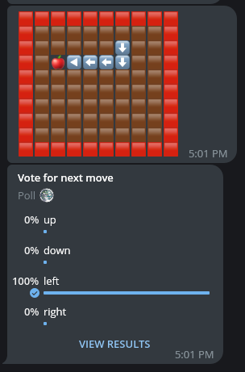

# Snake bot

## Summary
This is the implementation of the snake game within the Telegram bot.
Every minute, it collects votes from all users and submits the next move based on those votes.
That bot is available [here](https://t.me/shake_snake_bot).

## Screenshots


## How to run
- Install [requirements for Laravel](https://laravel.com/docs/10.x/deployment#server-requirements) 
- Install [composer](https://getcomposer.org/download/)
- Copy `.env.example` as `.env` file
- Add your token to `TELEGRAM_BOT_TOKEN` key
- Configure database `DB_CONNECTION`, `DB_HOST`, `DB_PORT`, `DB_DATABASE`, `DB_USERNAME`, `DB_PASSWORD`
- Run bot with command below:

```shell
php artisan bot:run 
```
